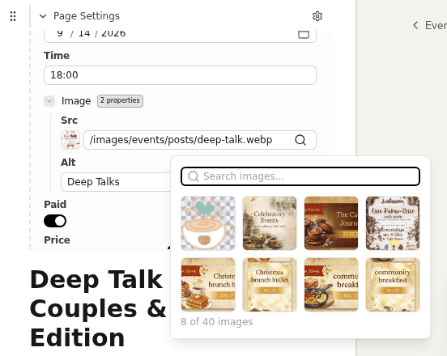

# Studio's image fields open a capped picker

Clicking an image field in Studio — an event's `image`, a menu item's, the homepage hero's —
opens a small popover: a search box over a grid of eight thumbnails and an `8 of 40 images`
line. No upload button, no folder tree, no second page. The Nuxt Studio playground shows a
full-width **Select Image** dialog instead, so the natural first assumption is that this project
has configured something wrong. It has not. This file records the diagnosis so the next person
does not repeat it.

Diagnosed against **`nuxt-studio@1.7.0`** (`@nuxt/content@3.15.2`, `nuxt@4.5.1`), and confirmed
in a local dev Studio rather than only by reading the bundle:

The `40` is whatever `public/` holds at the time — 40 when this was written — and the `8` never
moves.

## The package ships two media UIs, and a schema field gets the lesser one

Both are in the installed bundle, and each has its own label namespace in
`node_modules/nuxt-studio/dist/app/en-*.js`, which is the quickest way to tell which one you are
looking at:

| | Compact popover | Full dialog |
| --- | --- | --- |
| Component | `InputMedia` | `ModalMediaPicker` |
| Labels | `studio.form.media.*` | `studio.mediaPicker.*` |
| Tells | "Enter relative path or Public URL...", "Search images...", `{count} of {total} images` | "Select Image", "Choose an image from your media library", "Root folder" |
| Browsing | eight thumbnails, no pagination | twelve per page, paginated, directory tree |
| Actions | pick one of the eight | pick, **Upload**, **Use external source** |

The eight is hardcoded in `InputMedia` — a literal `.slice(0, 8)` applied *after* the search
filter, not a page size. There is no interaction that reveals the ninth image, and no module
option that changes it: `studio.media` accepts external storage, `maxFileSize`, `allowedTypes`
and a CDN URL, and nothing about the picker.

Studio's form dispatches on the `input` given in the collection schema — `media` renders
`InputMedia`, `string` renders `InputText`, `icon` renders `InputIcon`. So a field declared
`z.string().editor({ input: 'media' })` gets the compact one by construction.

`ModalMediaPicker` has exactly two consumers in the bundle, both of them editor nodes for images
and videos placed in a document's *body*. That is why the picker differs depending on where the
owner clicks: inline photos in an event's body open the full dialog; the `image` field in the
same event's form does not.

## The order of the slice is the whole story

`InputMedia` filters the full library by the search box first and only then keeps eight. Every
image is therefore reachable by typing part of its name — typing `hero` into the field above
returns `7 of 40 images`, six of which were not among the eight thumbnails. The cap costs
browsing, not access. That distinction is the difference between "inconvenient" and "blocked", and it is
why this is documented rather than worked around.

## Uploading was never in the field anyway

`ModalMediaPicker`'s **Upload** button does not upload in place: its handler calls
`switchFeature(Media)` and closes the dialog. Even upstream's richer picker routes uploading
through Studio's **Media** section, which is exactly where `docs/studio-access.md` sends the
owner. The workaround costs one extra click over the UI we are missing, not a capability.

## What is *not* wrong

- **The schema.** `@nuxt/content`'s `.editor()` annotation accepts three input kinds — `media`,
  `icon`, `textarea`. `media` is the only image-appropriate one and it is what every image field
  here already uses. Do not "fix" the image fields by changing `content.config.ts`.
- **The version.** `1.7.0` is the latest published release and the newest thing on the registry.
  There is nothing to upgrade to.
- **The absence of an override.** Studio's editor is a prebuilt client bundle served from a
  version-stamped path and copied into the build output. Its Vue components are compiled into
  that bundle, so the host application cannot substitute one through component resolution.

## One thing that is genuinely surprising

`InputText` — the plain `string` input, with no `.editor()` annotation at all — carries a name
heuristic. If the field's id, key or title contains any of `image`, `img`, `src`, `cover`,
`thumbnail`, `avatar`, `photo`, `picture`, `banner`, `logo` or `poster`, it renders a trailing
image button that opens `ModalMediaPicker`, the full dialog. So the same package opens the rich
picker for an *unannotated* string called `image` and the capped one for a string explicitly
annotated as media, which is backwards.

This is not a recommendation to drop the annotation. Doing so would trade the field's inline
thumbnail preview and its own search for the dialog, and would leave the collection schema
lying about what the field is — a decision worth making deliberately, if at all, once upstream
has answered whether the divergence is intended. It is recorded here because it is the sharpest
evidence that the field's compactness is an oversight rather than a design, and it belongs in
the upstream conversation.

## Upload location matters

Studio's media store is a virtual collection (`public-assets`) rooted at the project's `public/`
directory, which is why the field counts every image under `public/` (the favicon included) and
why an upload can land anywhere under it.
The build's image pass only walks `public/images` (`scripts/optimize-images.mjs`), so a photo
uploaded to the public root would ship un-normalised, escaping the resizing and WebP conversion
every other image gets. The owner-facing guide names the folder for that reason.

## Rejected

- **Patching the installed package.** The target is minified prebuilt output, so the patch would
  edit an opaque expression, need re-deriving on every version bump, and could not be verified by
  any check in this repository.
- **Dropping the media input from the schema.** See above — it is a real behaviour change, not a
  free win, and it is upstream's question to answer first.
- **Building a replacement picker.** Far beyond the value of the problem, and it would be thrown
  away when upstream fixes this.

## Verifying, and when to verify again

There is no seam to test. The behaviour lives entirely inside a third-party prebuilt bundle; no
module in this project changes, so a test here could only assert facts about someone else's
compiled JavaScript. A CI guard on the installed Studio version was considered and declined too
— it would fail on every unrelated bump and be noise rather than signal.

`package.json` asks for `^1.7.0`, so a newer Studio can arrive on an ordinary `npm install`
with nothing in the diff to notice it. The trigger is therefore `npm ls nuxt-studio`: whenever
it reports something past `1.7.0`, **re-check by hand**:

1. Open an event in Studio and click the `image` field. Note the picker's shape — search box,
   thumbnail grid, the `N of M images` line, no upload button.
2. Type part of an existing image's file name and confirm it can be selected even when it is not
   one of the eight shown.
3. In the **Media** section, upload a photo into `public/images/...` and confirm it is then
   selectable in the field.
4. Publish and confirm the image renders on the live page.

Steps 1 and 2 were run against a local dev Studio when this was written; 3 and 4 were not, since
they mean committing a throwaway photo. They are the owner's path, so they are worth running
once after any upgrade.

If step 1 now shows **Select Image** with a folder tree, this file and the corresponding section
of `docs/studio-access.md` can both go.

## Upstream

Filed as [nuxt-content/nuxt-studio#557][upstream] on 2026-09-09. It asks whether the compact
field is intended, and whether enabling external blob storage changes which control is rendered
— that last one is unknown here and cheap for a maintainer to answer. Its reproduction is a
three-line edit to Studio's own `playground/minimal`, so it stands without access to this
repository. Watch it for the answer that decides whether the `InputText` route above is worth
taking.

Related upstream: [#368][scoped-media] asks for a scoped media directory, which would also stop
an upload landing outside `public/images`.

[upstream]: https://github.com/nuxt-content/nuxt-studio/issues/557
[scoped-media]: https://github.com/nuxt-content/nuxt-studio/issues/368
